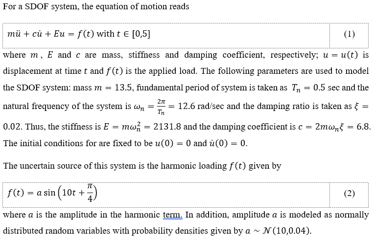
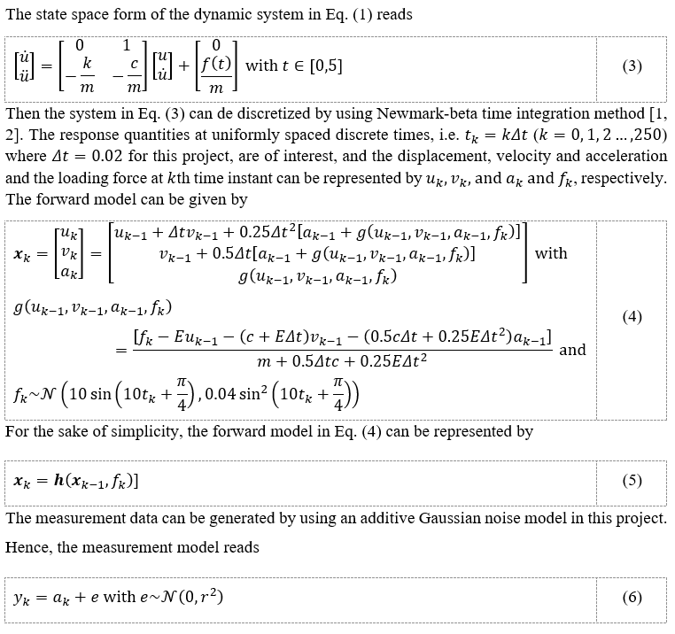

# Kalman-smoothers
A class for unscented Kalman smoother is implemented for predicting state varibles in the file "kalman_smoother.py".

## Dependency
- numpy
- scipy
- matplotlib

## Benchmark
The unscented Kalman smoother is used to predict displacement, velocity and acceleration for a single-degree-of-freedom system under random harmonic loading. The detailed description for the target dynamic system is given as follows:

  

However, to apply Kalman smoother, the stochastic problem should be rewritten in a state space form, which can be described as follows:

 

With the Kalman smoother, the predictions from Kalman filter and smoother can be summarized in the following table:

